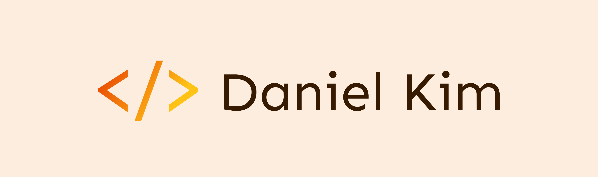

<h1 align="center">Hi 👋, I'm Daniel!</h1>

  
  
  
  

<h3 align="left">I'm a full stack web developer based in Philadelphia, PA.</h3>

> As a technology agnostic software engineer with a background in program management, soft skills like adaptability, creativity, and curiosity have served me well. I am a quick learner who enjoys experimenting with new technologies. My touchstone has always been innovating to determine efficient solutions to complex problems.
> Looking to bring my software development skills to a product oriented tech company with global reach 🌎.

- 🌱 I’m currently learning **Next.JS**
- 👨‍💻 All of my projects are available at **[https://daniel-jkim.com/](https://daniel-jkim.com/)**
- 📫 How to reach me **dan.jkim21@gmail.com**
- ⚡ Fun fact, **before software engineering, I used to work in nuclear energy policy!**
   

<h3 align="left">Languages and Tools:</h3>

 
  

    
    
    
    
    
    
		 
    
    
	  		
    
		 
    
    

 

<h2>Projects</h2>

<table>
	<tr>
	<td width="50%">
          <h3 align="center">arDB</h3>
          

             
		
		
            

		A RESTful API containing web scraped data of advanced nuclear reactor designs.
            

          

        </td>
        <td width="50%">
          <h3 align="center">Portfolio Site</h3>
          

             
		
		
            

		My React.js portfolio website. Have a look!
            

          

        </td>

  </tr>
      <tr>
        <td width="50%">
          <h3 align="center">Bookly</h3>
          

             
		
		
            

		Discover new books and save them to your reading playlist!
            

          

        </td>
	<td width="50%">
          <h3 align="center">Outpost</h3>
          

            
		
		
            

            Log in and keep track of your upcoming trips, travel destinations, and activities!
            

          

        </td>
    </tr>
</table>

  
<h2 align="left">My Github Stats</h3>

