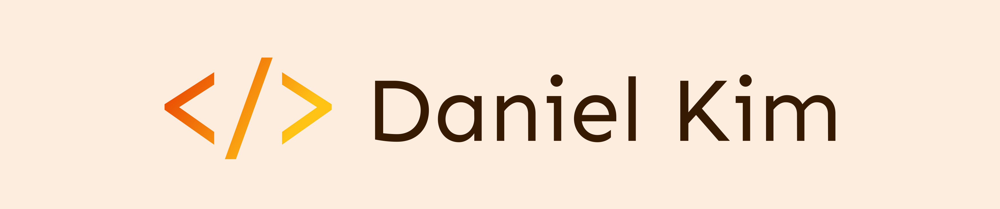

<h1 align="center">Hi 👋, I'm Daniel!</h1>

  
  
  

<h3 align="left">I'm a full stack web developer based in Portland, Maine.</h3>

> From program director to developer, soft skills like **adaptability, creativity, and curiosity** have served me well. As a quick learner who enjoys experimenting with new technology, my touchstone has always been **innovating** to determine efficient solutions to complex problems. I excel in managing multiple projects and tackling new tasks as priorities shift. 
> Looking to bring my software development skills to a tech company with global reach.

- 🌱 I’m currently learning **MongoDB, Express, React, Node**
- 👨‍💻 All of my projects are available at **[https://daniel-jkim.com/](https://daniel-jkim.com/)**
- 📫 How to reach me **dan.jkim21@gmail.com**
- ⚡ Fun fact, **before software engineering, I used to work in nuclear security and nonproliferation policy!**
 

<h3 align="left">Languages and Tools:</h3>

 
  

    
    
    
    
    
    
    
    
    
    

 

***

  
<h3 align="left">My Github Stats</h3>

  
  
&nbsp;

  

  
<h3 align="left">Most Used Languages:</h3>

  
  

